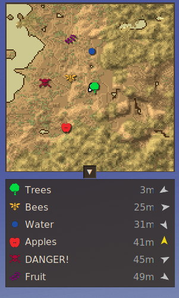

# Minimap Waypoint List

A [Vintage Story](https://www.vintagestory.at/) client mod that lists your nearby waypoints below the minimap.




## Features

- Lists waypoints currently visible on the minimap, nearest first
- Each row shows the waypoint's own icon and color, its name, distance, and an arrow pointing toward it (relative to the direction you're facing, turning yellow when you're looking straight at it)
- A toggle button docked onto the minimap's own edge shows/hides the list
- Columns resize to fit the content and the current UI scale; the panel is never narrower than the minimap
- Follows the minimap's screen corner and open/closed state automatically, and keeps the vanilla coordinate HUD positioned below the list instead of overlapping it

## Installation

Download the latest release zip from the [Releases page](https://github.com/jhuebel/MinimapWaypointList/releases) and drop it into your Vintage Story `Mods` folder, then restart the game.

## Configuration

The maximum number of waypoints shown is stored in `ModConfig/MinimapWaypointList.json` in your Vintage Story data folder:

```json
{
  "MaxMarkersShown": 10
}
```

Editing this file requires a game restart to take effect. To change it without restarting, use the in-game chat command instead:

```
/mwl maxwaypoints        # shows the current value
/mwl maxwaypoints 15     # sets it to 15 and saves immediately
```

## Building from source

Requires the .NET SDK and a local Vintage Story install.

```bash
export VINTAGE_STORY=/path/to/your/vintagestory/install
dotnet build -c Release
```

The built mod is placed in `bin/Release/Mods/MinimapWaypointList/`. To package it for distribution:

```bash
cd bin/Release/Mods/MinimapWaypointList
zip -r ../../../../dist/minimapwaypointlist_<version>.zip modinfo.json MinimapWaypointList.dll MinimapWaypointList.pdb
```
